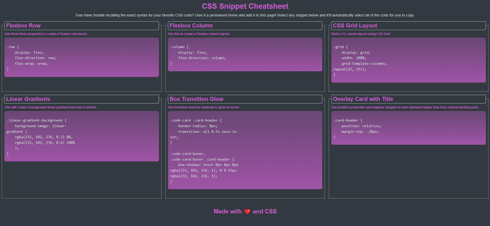

# Module 02 Mini-Project

## Description

The purpose of this project was to demonstrate my ability to use more advanced HTML and CSS functionality to create a webpage with a simple use case. 

**What was your motivation?** My main motivation for building this webpage was to get more advanced practice in HTML and CSS use cases. 
**Why did you build this project?** Although this was not a "mandatory" project, I wanted to expand on my knowledge and understanding of HTML and CSS. 
**What problem does it solve?** This webpage allows developers to simply click, copy, and paste snippets of CSS, therefore negating the need to memorize rarely used CSS properties.  
**What did you learn?** Some of the big things I learned include: 

**HTML**
- Exposure to more advanced HTML elements such as pre and code
- Organizing div elements within section elements 

**CSS**
- Use of CSS variables
- Creating a responsive layout
- Using the grid layout and flexbox
- Adding advanced visual aesthetic elements like linear gradients, border radius, and box transition glow

## Usage
Each box contains snippets of CSS that can be copied and pasted so that developers don't have to recall these from memory. Each snippet can be selected with a simple mouse click and then copied and pasted using their preferred method. When the user hovers over each box, there will be a subtle glow to emphasize which code they're going to select. 

## Credits
The original goals and deliverables were presented by Denver University in the Bootcamp course ID DU-VIRT-FSF-PT-12-2023-U-LOLC-MWTH under Module 2 Activity. All code was generated and submitted by Jordan R. Heersink. 

MIT License

Copyright (c) 2023 Jordan Heersink

Permission is hereby granted, free of charge, to any person obtaining a copy
of this software and associated documentation files (the "Software"), to deal
in the Software without restriction, including without limitation the rights
to use, copy, modify, merge, publish, distribute, sublicense, and/or sell
copies of the Software, and to permit persons to whom the Software is
furnished to do so, subject to the following conditions:

The above copyright notice and this permission notice shall be included in all
copies or substantial portions of the Software.

THE SOFTWARE IS PROVIDED "AS IS", WITHOUT WARRANTY OF ANY KIND, EXPRESS OR
IMPLIED, INCLUDING BUT NOT LIMITED TO THE WARRANTIES OF MERCHANTABILITY,
FITNESS FOR A PARTICULAR PURPOSE AND NONINFRINGEMENT. IN NO EVENT SHALL THE
AUTHORS OR COPYRIGHT HOLDERS BE LIABLE FOR ANY CLAIM, DAMAGES OR OTHER
LIABILITY, WHETHER IN AN ACTION OF CONTRACT, TORT OR OTHERWISE, ARISING FROM,
OUT OF OR IN CONNECTION WITH THE SOFTWARE OR THE USE OR OTHER DEALINGS IN THE
SOFTWARE.

## **This is the end of original content from Jordan Heersink. The original readme provided by Denver University is below. **

# Module 02 Mini-Project: CSS Snippet Cheat Sheet

In this activity, you will work with a group to build a webpage that will hold a collection of CSS snippets. What better way to learn CSS than to build a knowledge base of CSS?

## Instructions

The completed application should meet the following criteria:

* As a user, I can view a collection of labeled CSS snippets in a responsive grid.

* As a user, I can easily identify these CSS snippets by their headings.

* As a user, I can highlight a code snippet by clicking on it.

* As a user, I can view my application on a mobile device as well as a desktop.

### Specifications

* Must use semantic HTML elements and proper indentation.

* Use CSS variables to maintain clean and reusable values for a color scheme.

* Use flexbox and media queries to create a responsive grid layout.

* Each CSS snippet should have a card-like layout with the CSS syntax wrapped in an [HTML pre element](https://developer.mozilla.org/en-US/docs/Web/HTML/Element/pre).

* Each CSS snippet can easily be highlighted for copying on click using the [CSS user-select property](https://developer.mozilla.org/en-US/docs/Web/CSS/user-select).

* Must incorporate a background color using a [CSS linear-gradient function](https://developer.mozilla.org/en-US/docs/Web/CSS/linear-gradient).

* Must incorporate a bit of animation using the [CSS transition property](https://developer.mozilla.org/en-US/docs/Web/CSS/transition).

* You and your group can decide which CSS styles and colors you will use to design the application, but the app needs to be a responsive. Use the following images to gain an understanding of how the app should look at different screen sizes, from a layout perspective:

  * At size 992px and above, the app should resemble the following image:

    

  * At size 768px and above, the app should resemble the following image:

    

  * On mobile devices, anything under 768px, the app should resemble the following image:

    

## 💡 Hints

* The HTML `<pre>` element is very literal about spaces and indentation. To gain a better understanding of how to work with it, check out this article on [considerations for styling the pre tag](https://css-tricks.com/considerations-styling-pre-tag/).

## 🏆 Bonus

* Set this project up in your own GitHub repositories so that you can deploy and use it for future reference!

---
© 2023 edX Boot Camps LLC. Confidential and Proprietary. All Rights Reserved.
